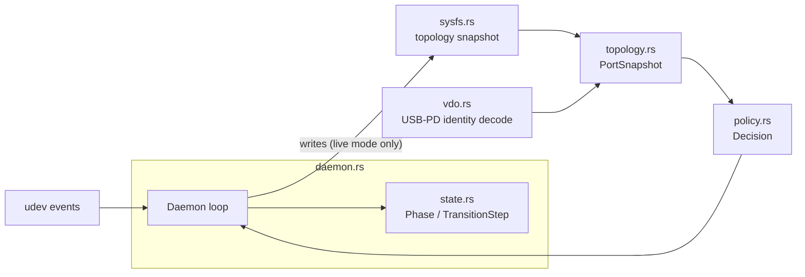

# cros-typec-selector

Generic USB-C mode selector for Chrome EC systems that advertise AP-driven
mode entry. It reconciles the Linux Type-C connector class (`/sys/class/typec`)
and chooses a data mode in priority order — USB4, Thunderbolt compatibility,
DisplayPort, then ordinary USB — based on USB-PD identity and alternate-mode
data, never peripheral identifiers.

The selector never authorizes Thunderbolt devices, calls `boltctl`, or
touches the `boltd` store. Router authorization remains exclusively owned by
`boltd`; this program only requests USB4 entry/exit and DP/TBT alternate-mode
activation through the connector class.

## Quick Start

Every command is read-only by default. Writes require the explicit `--live`
flag, and the daemon requires it.

```text
cros-typec-selector inspect [PORT]              # dump discovered topology
cros-typec-selector decide [PORT]                # show the policy decision, no writes
cros-typec-selector reconcile [PORT] [--live]    # apply the decision (dry-run without --live)
cros-typec-selector daemon --live                # follow udev events and reconcile continuously
```

### NixOS

The flake exposes a package and a NixOS module. Import the module and enable
the service:

```nix
{
  inputs.cros-typec-selector.url = "github:<owner>/cros-typec-selector";

  # in your NixOS configuration:
  imports = [ inputs.cros-typec-selector.nixosModules.default ];
  services.cros-typec-selector.enable = true;
}
```

This installs a hardened `systemd` unit (`cros-typec-selector daemon --live`)
scoped to `ReadWritePaths = [ "/sys/class/typec" ]`. If your kernel exposes
the class symlinks read-only for writes, override
`services.cros-typec-selector.writableSysfsPaths` with the canonical
`/sys/devices/...` paths instead.

Build and inspect the package directly with:

```sh
nix build .#default
nix run .#default -- inspect
```

### non-NixOS

Build with Cargo (requires `pkg-config` and `systemd` development headers):

```sh
cargo build --release
sudo install -Dm755 target/release/cros-typec-selector /usr/bin/cros-typec-selector
sudo install -Dm644 man/cros-typec-selector.8 /usr/share/man/man8/cros-typec-selector.8
sudo install -Dm644 systemd/cros-typec-selector.service \
  /usr/lib/systemd/system/cros-typec-selector.service
```

Enable the daemon:

```sh
sudo systemctl daemon-reload
sudo systemctl enable --now cros-typec-selector.service
```

The shipped unit is hardened (`ProtectSystem=strict`, empty
`CapabilityBoundingSet`, `ReadWritePaths=/sys/class/typec`, no network
address families). Adjust `ReadWritePaths` if your distribution mounts the
Type-C class differently.

Some kernels enter DisplayPort automatically before USB4 discovery is
coherent, which the daemon can only detect and refuse to fight (it reports
`coordination-required` rather than risking a disruptive mode replacement).
The optional kernel patch in `kernel/` marks AP-driven altmodes so automatic
entry is suppressed on systems that request AP ownership; carry it downstream
if your kernel does not already defer mode selection.

## Architecture



- **`sysfs.rs`** — reads the Type-C connector class
  (`portN`, `portN-partner`, `portN-cable`, `portN-partner.M`,
  `portN-plug0.M`, associated USB4 domain children) and performs the four
  supported writes (`usb_mode` enter/exit USB4, alternate-mode `active`
  enter/exit). It tags every read with a topology generation so a delayed
  write can be discarded if the connector changed underneath it.
- **`topology.rs`** — turns a raw sysfs read into a `PortSnapshot`: normalized
  data role, USB4 capability/domain association, partner/cable PD identity,
  and available alternate modes. Absent optional objects are represented
  explicitly rather than assumed.
- **`vdo.rs`** — decodes USB-PD identity and alternate-mode VDOs into
  structured fields used by policy.
- **`policy.rs`** — pure function from a `PortSnapshot` (plus host capability)
  to a `Decision`: a `Candidate` (USB4 > TBT-compatibility > DisplayPort >
  ordinary USB) or a `WaitReason` while discovery is incomplete. Policy has no
  I/O and never reads Thunderbolt `authorized` attributes.
- **`state.rs`** — the per-port state machine (`Phase`: `Detached` →
  `Discovering` → `Selecting` → `Exiting`/`Entering` → `Active`/`Idle`, or
  `Failed`) and `transition_steps`, which sequences exit-before-enter so a
  disruptive mode change never skips the required "wait for none" step.
  Discovery and transition attempts are bounded by `DISCOVERY_TIMEOUT` /
  `TRANSITION_TIMEOUT` and use fixed retry backoff (`RETRY_DELAYS`).
- **`udev.rs`** — subscribes to Type-C class udev events and turns them into
  re-enumeration hints; events are never treated as a complete topology by
  themselves.
- **`daemon.rs`** — owns the event loop, per-port state machines, and the
  read-only/`--live` gate; drives `sysfs.rs` writes only after `policy.rs` and
  `state.rs` agree a transition is due and safe.
- **`error.rs`** — the crate's error type shared across modules.

See `docs/policy.md` for the ownership boundary with `boltd` and the
rationale for not depending on `libtypec` yet, and `docs/interface-inventory.md`
for the exact sysfs paths read and written, plus a worked live-experiment
walkthrough.
</content>
<parameter name="i">Write README